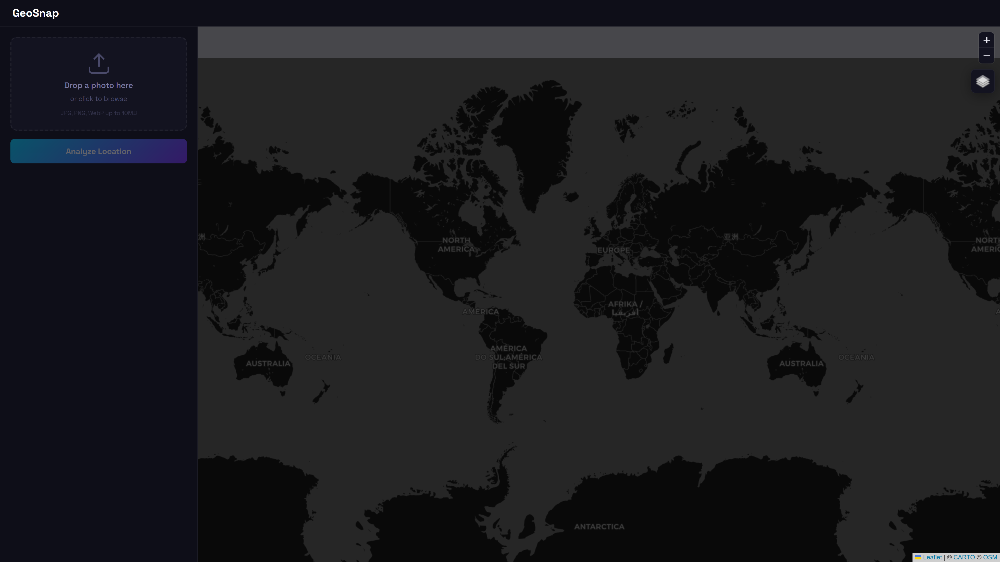
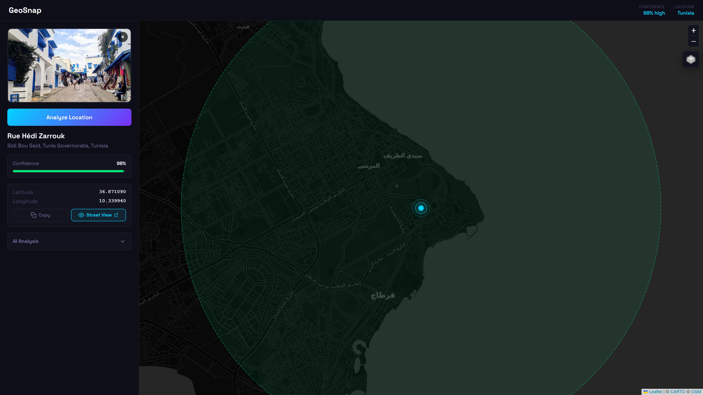
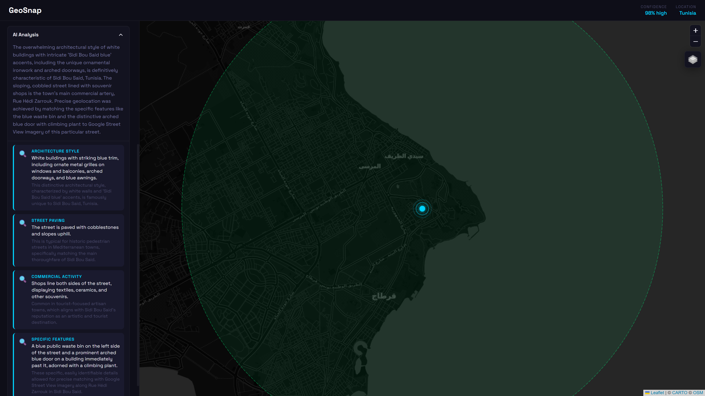

# GeoSnap — AI-Powered Photo Geolocation

<div align="center">

**Upload any photo. AI pinpoints the exact location on the map.**

GeoSnap uses advanced vision AI to analyze visual clues in photographs — street signs, architecture, vegetation, text, language scripts, road markings, and more — to determine the precise geographic location where a photo was taken.

[Features](#features) | [Demo](#demo) | [Quick Start](#quick-start) | [How It Works](#how-it-works) | [Tech Stack](#tech-stack)

</div>

---

## Demo

| Upload & World View | Location Detected | AI Analysis & Clues |
|:---:|:---:|:---:|
|  |  |  |

## Features

- **AI Vision Analysis** — Powered by Google Gemini, analyzes 15+ visual clue categories including street signs, architecture, vegetation, language scripts, license plates, road markings, and infrastructure patterns
- **Precision Mapping** — Interactive dark-themed map with animated pulsing markers, confidence radius visualization, and smooth fly-to animations
- **Multi-Layer Maps** — Toggle between Dark, Satellite, and Street map views (Leaflet.js with CartoDB & Esri tiles)
- **Confidence Scoring** — Color-coded confidence meter (high/medium/low) with dynamic radius circles reflecting location certainty
- **Google Street View** — One-click Street View access for any detected location
- **Drag & Drop Upload** — Intuitive photo upload with live preview, file validation, and automatic image optimization
- **AI Clue Breakdown** — Expandable panel showing every visual clue the AI detected, categorized by type with detailed reasoning
- **Responsive Design** — Full dark theme with glassmorphism UI, works on desktop and mobile
- **Dual AI Backend** — Supports Google Gemini (cloud, fast & accurate) and Ollama (local, fully offline)
- **Smart Image Pipeline** — Automatic resizing and JPEG compression via Sharp for optimal AI processing speed

## Quick Start

### Prerequisites

- [Node.js](https://nodejs.org/) 18+
- A free [Google Gemini API key](https://aistudio.google.com/apikey) (recommended) **or** [Ollama](https://ollama.com/) for local inference

### Setup

```bash
# Clone the repository
git clone https://github.com/aymenhmaidiwastaken/geosnap.git
cd geosnap

# Install dependencies
npm install

# Configure your API key
cp .env.example .env
# Edit .env and add your Gemini API key (free at https://aistudio.google.com/apikey)

# Start the server
npm start
```

Open **http://localhost:3000** and upload a photo.

### Using Ollama (Fully Offline)

If you prefer local AI with no API keys:

```bash
# Install Ollama from https://ollama.com
ollama pull llama3.2-vision

# Remove GEMINI_API_KEY from .env (or leave it empty)
# GeoSnap will automatically fall back to Ollama

npm start
```

> **Note:** Local models are less accurate than Gemini for geolocation tasks. Gemini's free tier (1,500 requests/day) is recommended for best results.

## How It Works

```
Photo Upload ──> Image Optimization ──> AI Vision Analysis ──> JSON Parsing ──> Map Rendering
                  (Sharp: resize,        (Gemini/Ollama:        (Robust repair     (Leaflet: flyTo,
                   JPEG compress)          15+ clue types)        + fallback)        pulsing marker,
                                                                                     confidence circle)
```

1. **Image Pipeline** — Uploaded photos are resized to 1024px and compressed to JPEG via Sharp, balancing detail preservation with processing speed
2. **Vision Analysis** — The AI examines the image for street signs, text/language (Arabic, Latin, Cyrillic, CJK), architectural styles, vegetation patterns, road infrastructure, vehicle types, and 10+ other clue categories
3. **Structured Output** — The AI returns structured JSON with coordinates, confidence levels, location metadata, and a detailed clue breakdown
4. **JSON Repair Engine** — A multi-strategy parser handles malformed AI output: progressive trimming, bracket closure, and regex field extraction as fallback
5. **Map Visualization** — The detected location is rendered with an animated pulsing marker, a confidence-radius circle (color-coded by certainty), and a smooth fly-to animation

## Tech Stack

| Layer | Technology |
|-------|-----------|
| **Frontend** | Vanilla JS, Leaflet.js, CSS3 Animations |
| **Backend** | Node.js, Express |
| **AI** | Google Gemini 2.5 Flash / Ollama (LLaMA 3.2 Vision) |
| **Image Processing** | Sharp |
| **Maps** | CartoDB Dark Matter, Esri Satellite, CartoDB Voyager |

## Project Structure

```
geosnap/
├── server.js          # Express API server with dual AI provider support
├── public/
│   ├── index.html     # Single-page application shell
│   ├── styles.css     # Dark theme, animations, responsive layout
│   └── app.js         # Map rendering, upload handling, results display
├── screenshots/       # Demo screenshots
├── .env.example       # Environment template
└── package.json
```

## API

### `POST /api/analyze`

Upload an image for geolocation analysis.

**Request:** `multipart/form-data` with an `image` field

**Response:**
```json
{
  "latitude": 36.8711,
  "longitude": 10.2344,
  "confidence": "high",
  "confidencePercent": 88,
  "locationName": "Rue Hedi Zarrouk",
  "city": "Sidi Bou Said",
  "country": "Tunisia",
  "countryCode": "TN",
  "analysis": {
    "clues": [
      {
        "type": "architecture",
        "observation": "White-washed buildings with blue trim",
        "significance": "Characteristic of Sidi Bou Said, Tunisia"
      }
    ],
    "reasoning": "Mediterranean architecture with distinctive blue-and-white color scheme..."
  }
}
```

## License

MIT

---

<div align="center">

Built by [@aymenhmaidiwastaken](https://github.com/aymenhmaidiwastaken)

</div>
